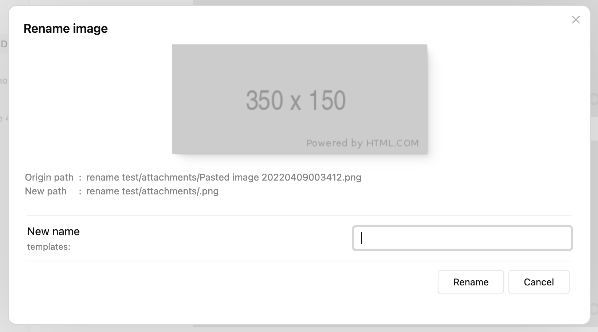
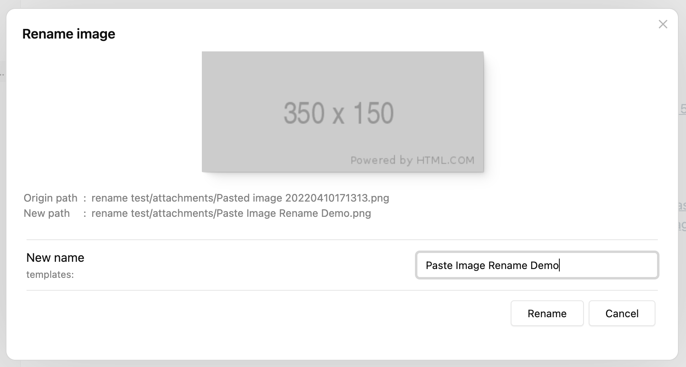
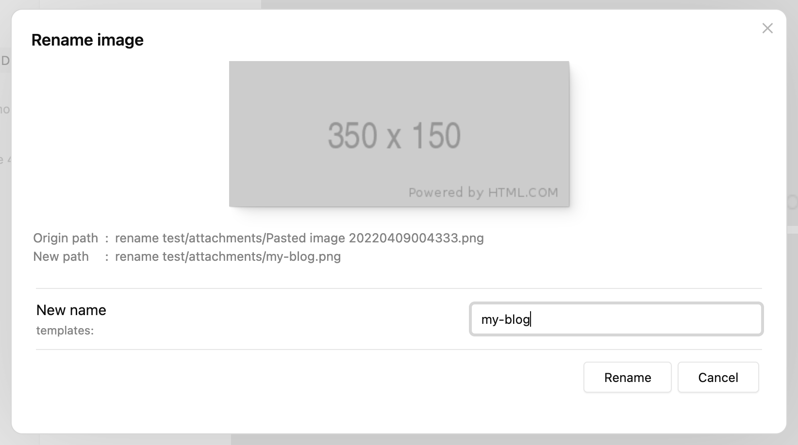
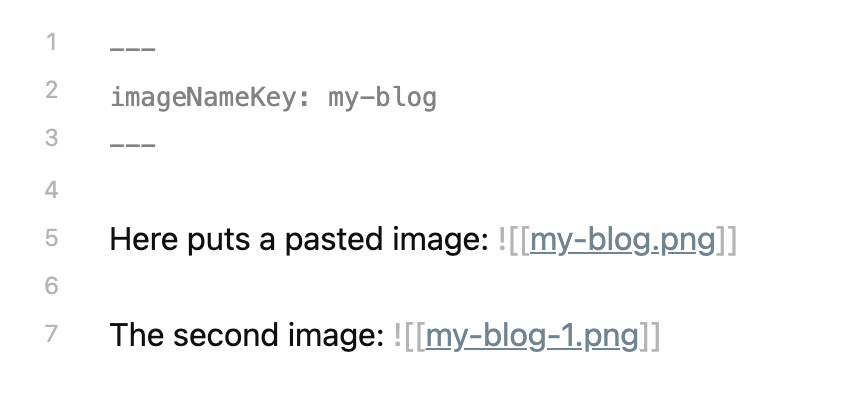
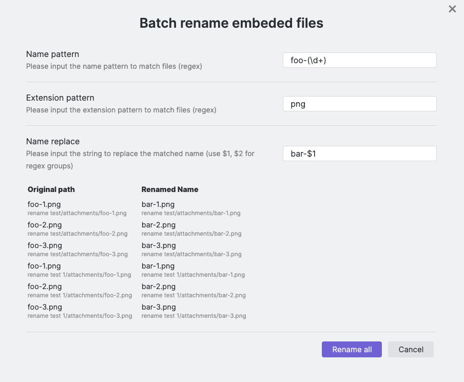
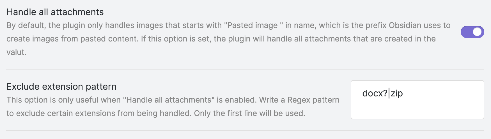

# Obsidian paste image rename

> :loudspeaker: Starting from 1.4.0, Paste image rename becomes a general-purpose renaming plugin
> that can handle all attachments added to the vault.

This plugin is inspired by Zettlr, Zettlr shows a prompt that allows the user to rename the image, this is a great help if you want your images to be named and organized clearly.

<details>
  <summary>Zettlr's prompt after pasting an image</summary>

  
</details>

Paste image rename plugin not only implements Zettlr's feature, but also allows you to customize how the image name would be generated, and eventually free you from the hassle by automatically renaming the image according to the rules.

**Table of Contents**
- [Obsidian paste image rename](#obsidian-paste-image-rename)
  - [How to use](#how-to-use)
    - [Basic usage](#basic-usage)
    - [Set `imageNameKey` frontmatter](#set-imagenamekey-frontmatter)
    - [Add prefix/suffix to duplicated names](#add-prefixsuffix-to-duplicated-names)
    - [Batch renaming process](#batch-renaming-process)
    - [Batch rename all images instantly](#batch-rename-all-images-instantly)
    - [Handle all attachments](#handle-all-attachments)
  - [FAQ](#faq)
  - [Settings](#settings)

## How to use

### Basic usage

After installing the plugin, you can just paste an image to any document and the rename prompt will display:


By typing the new name and clicking "Rename" (or just press enter), the image will be renamed and the internal link will be replaced with the new name.

If you set "Image name pattern" to `{{fileName}}` (it's the default behavior after 1.2.0),
"New name" will be generated as the name of the active file.


### Set `imageNameKey` frontmatter

While adding a lot of images to one document, people possibly want the images to be named in the same format, that's where `imageNameKey` is useful.

First set a value for `imageNameKey` in frontmatter:

```
---
imageNameKey: my-blog
---
```

Then paste an image, you will notice that the "New name" has already been generated as "my-blog", which is exactly the value of `imageNameKey`:


You can change the pattern for new name generating by updating the "Image name pattern" value in settings.

For a detailed explanation and other features such as auto renaming, please refer to [Settings](#settings).


### Add prefix/suffix to duplicated names

The plugin will always try to add a prefix/suffix if there's a file of the same name.

Let's continue from the last section and paste the second image, the prompt will still show the new name as "my-blog", now if we just click "Rename", the file will be renamed as "my-blog-1.png", not "my-blog.png":



The `-1` suffix is generated according to the default settings:
- Because "Duplicate number at start" is false, suffix is used rather than prefix
- "Duplicate number delimiter" `-` is put before the number `1`

If we paste the third image without editing the "New name" input, its name will be "my-blog-2.png", the number is increased according to the largest number of "my-blog-?.png" in the attachment directory.

This feature is especially powerful if you enable "Auto rename" in settings, you can just add new images without thinking, and they will be renamed sequentially by the pattern and `imageNameKey` set.

### Batch renaming process

> New in 1.3.0

You can use the command "Batch rename embeded files in the current file"
to rename images and other attachments (even notes) in the current file.



The image above demonstrates how to rename all the `foo-1.png`, `foo-2.png`… png files
to `bar-1-png`, `bar-2.png`… with this feature.

You can also rename the images to the same name, and let the plugin handle
the name deduplication for you.  See a video demonstration here:
https://i.imgur.com/6UICugX.mp4


### Batch rename all images instantly

> New in 1.5.0

The command "Batch rename all images instantly (in the current file)" will
rename all the images in the current file according to
"Image name pattern" in settings.

This is a shortcut for using [Batch renaming process](#batch-renaming-process) with certain arguments,
makes everyday image renaming much easier.

Note that this command has no confirmation, please use it with caution!

### Handle all attachments

> New in 1.4.0

Paste image rename is not just a plugin for pasted images, it has the potential
to handle all attachments that are added to the vault, no matter whether they are pasted
or dragged.

To use this feature, you need to enable the "Handle all attachments" option in settings.



Additionally, you can configure the "Exclude extension pattern" to ignore files
that match the given extension pattern.


## FAQ

- Q: I pasted an image but the rename prompt did not show up.

    A: This is probably because you are using the Windows system and pasting from a file (i.e. the image is copied from File Explorer, not from a browser or image viewer). In Windows, pasting from a file is like a regular file transfer, the original filename is kept rather than being created and named "Pasted image ..." by Obsidian. You need to turn on "Handle all attachments" in settings to make it work in this situation.

## Settings

- **Image name pattern**

  The pattern indicates how the new name should be generated.

  - Available variables:
    - `{{fileName}}`: name of the active file, without ".md" extension.
    - `{{imageNameKey}}`: this variable is read from the markdown file's frontmatter, from the same key `imageNameKey`.
    - `{{DATE:$FORMAT}}`: use `$FORMAT` to format the current date, `$FORMAT` must be a Moment.js format string, e.g. `{{DATE:YYYY-MM-DD}}`.

  - Examples

    Here are some examples from pattern to image names (repeat in sequence), variables: `fileName = "My note", imageNameKey = "foo"`:
    - `{{fileName}}`: My note, My note-1, My note-2
    - `{{imageNameKey}}`: foo, foo-1, foo-2
    - `{{imageNameKey}}-{{DATE:YYYYMMDD}}`: foo-20220408, foo-20220408-1, foo-20220408-2
- **Duplicate number at start (or end)**

  If enabled, the duplicate number will be added at the start as prefix for the image name, otherwise, it will be added at the end as suffix for the image name.
- **Duplicate number delimiter**

  The delimiter to generate the number prefix/suffix for duplicated names. For example, if the value is `-`, the suffix will be like "-1", "-2", "-3", and the prefix will be like "1-", "2-", "3-".
- **Auto rename**

  By default, the rename modal will always be shown to confirm before renaming, if this option is set, the image will be auto renamed after pasting.
- **Handle all attachments**

  By default, the rename modal will always be shown to confirm before renaming, if this option is set, the image will be auto renamed after pasting.

- **Exclude extension pattern**

  This option is only useful when "Handle all attachments" is enabled.
	Write a Regex pattern to exclude certain extensions from being handled. Only the first line will be used.
- **Disable rename notice**

  Turn off this option if you don't want to see the notice when renaming images.
	Note that Obsidian may display a notice when a link has changed, this option cannot disable that.
